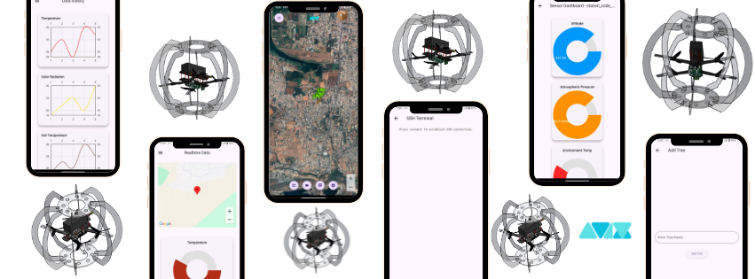

# 🌾 AV10 Flutter Application - Precision Agriculture Companion App



**AV10** is a smart precision agriculture mobile application developed using **Flutter**, designed to work with the AV10 ecosystem. It offers real-time monitoring, drone control, IoT integration, and deep learning-powered agriculture insights for farmers and field owners.

---

## 🚀 Features

- 📡 **Live Drone Streaming** from Edge Computer (Raspberry Pi)
- 🧠 **ML Integration** for:
  - Soil Type Identification
  - NDVI Estimation
  - Disease Detection & Classification
  - Fertilizer and Soil Health Recommendations
- 🌦️ **Environmental Monitoring** with IoT ground station
- 🗺️ **Google Maps Integration** for field navigation
- 📱 **Farmer Smartwatch Sync** for alerts and controls
- 💬 **Chatbot** for instant query resolution
- 🔐 **Blockchain-based Storage** for secure data logging

---

## 📱 Tech Stack

- **Flutter** & **Dart** – Cross-platform mobile development
- **Firebase** – Authentication & Database
- **ROS2** – Sensor Fusion & Communication
- **YOLO, SegNet, ResNet** – Deep Learning Models
- **Raspberry Pi** – Drone edge computing
- **STM32** – PID Throttle Control for Drone
- **Blockchain** – Decentralized Data Storage

---

## 🛠️ Getting Started

### Prerequisites

- Flutter SDK
- Dart SDK
- Android Studio / Xcode
- Firebase account
- Raspberry Pi with camera setup
- IoT ground sensors

### Installation

```bash
git clone https://github.com/your-username/av10_flutter_app.git
cd av10_flutter_app
flutter pub get
flutter run
